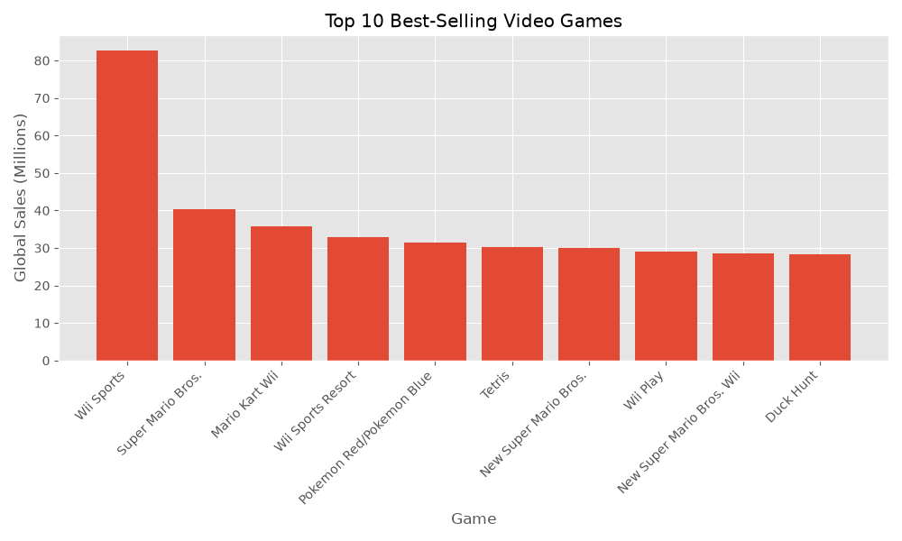
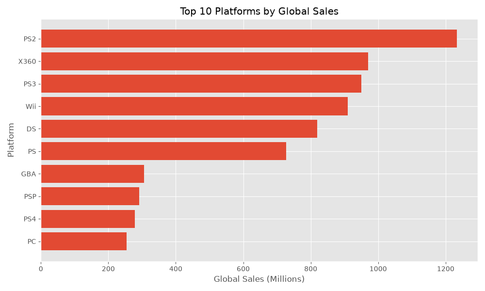
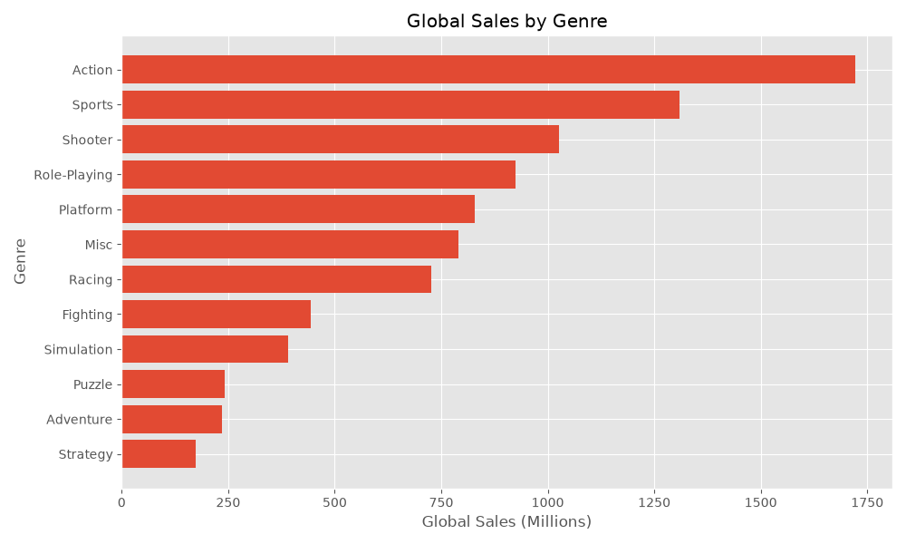
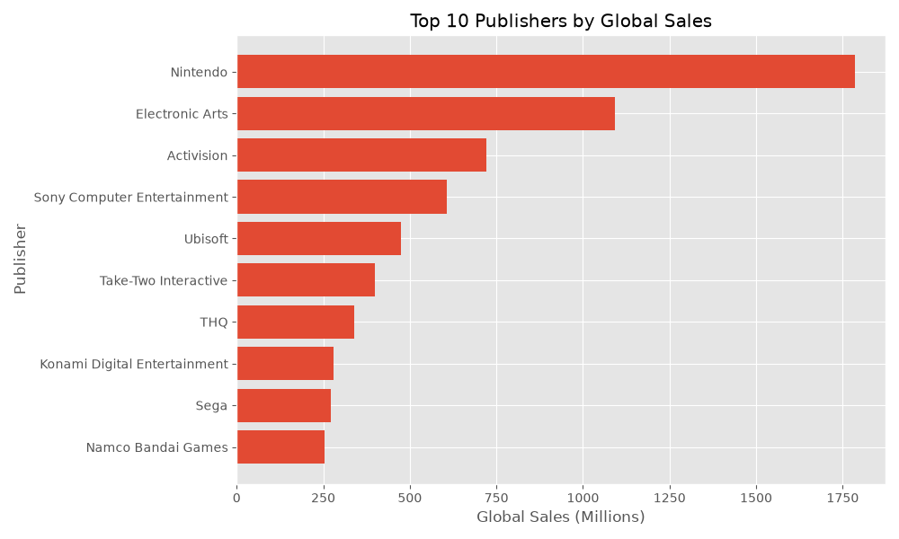
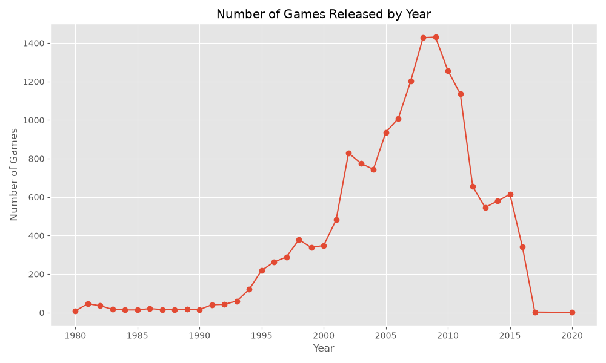
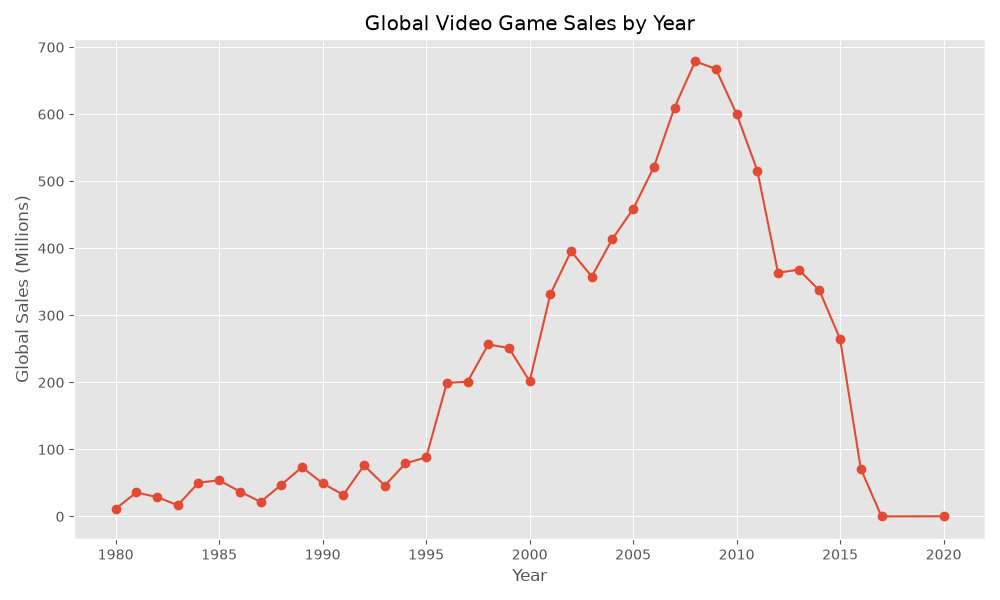
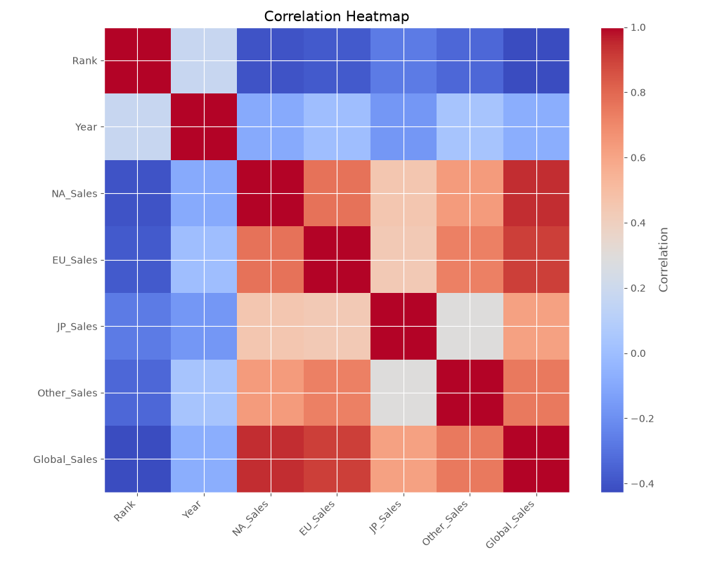

# 🎮 Video Game Sales Analysis

## 📌 Project Overview

This project explores the **Video Game Sales** dataset using Python. The main goal is to perform **Exploratory Data Analysis (EDA)** to discover sales trends, identify the best-selling games, analyze platform and genre performance, and visualize key insights through informative charts.

The project follows a modular structure by separating data loading, cleaning, analysis, and visualization into different Python modules.

---

## 📂 Dataset

The dataset contains historical video game sales information, including:

* Game Name
* Platform
* Release Year
* Genre
* Publisher
* North America Sales
* Europe Sales
* Japan Sales
* Other Region Sales
* Global Sales

---

## 🛠️ Technologies Used

* Python
* Pandas
* NumPy
* Matplotlib
* Git & GitHub

---

## 📁 Project Structure

```text
Video-Game-Sales-Analysis/
│
├── data/
│   └── video_games_sales.csv
│
├── images/
│
├── src/
│   ├── data_loader.py
│   ├── data_cleaning.py
│   ├── analysis.py
│   └── visualization.py
│
├── main.py
├── requirements.txt
├── README.md
└── .gitignore
```

---

## 🔍 Exploratory Data Analysis

The following analyses were performed throughout the project:

* Data Inspection
* Data Cleaning
* Summary Statistics
* Top 10 Best-Selling Games
* Top Platforms by Global Sales
* Top Genres by Global Sales
* Top Publishers by Global Sales
* Number of Games Released by Year
* Global Sales by Year
* Correlation Heatmap

---

## 📊 Visualizations

### Top 10 Best-Selling Games



### Top Platforms by Global Sales



### Top Genres by Global Sales



### Top Publishers by Global Sales



### Games Released by Year



### Global Sales by Year



### Correlation Heatmap




---

## 💡 Key Insights

- Action is the best-selling video game genre.
- PS2 is the highest-selling gaming platform.
- Nintendo is among the most successful publishers in terms of total sales.
- The number of game releases increased significantly during the 2000s.
- Global video game sales peaked before declining in later years.
- The correlation heatmap highlights strong relationships between sales-related variables.
---

## 🚀 How to Run

1. Clone the repository.

```bash
git clone <repository-url>
```

2. Navigate to the project directory.

```bash
cd Video-Game-Sales-Analysis
```

3. Install the required libraries.

```bash
pip install -r requirements.txt
```

4. Run the project.

```bash
python main.py
```

---

## 📈 Future Improvements

* Build an interactive dashboard using Plotly or Streamlit.
* Perform predictive analysis using machine learning models.
* Add more advanced visualizations.

---

## 👤 Author

**Ata**
